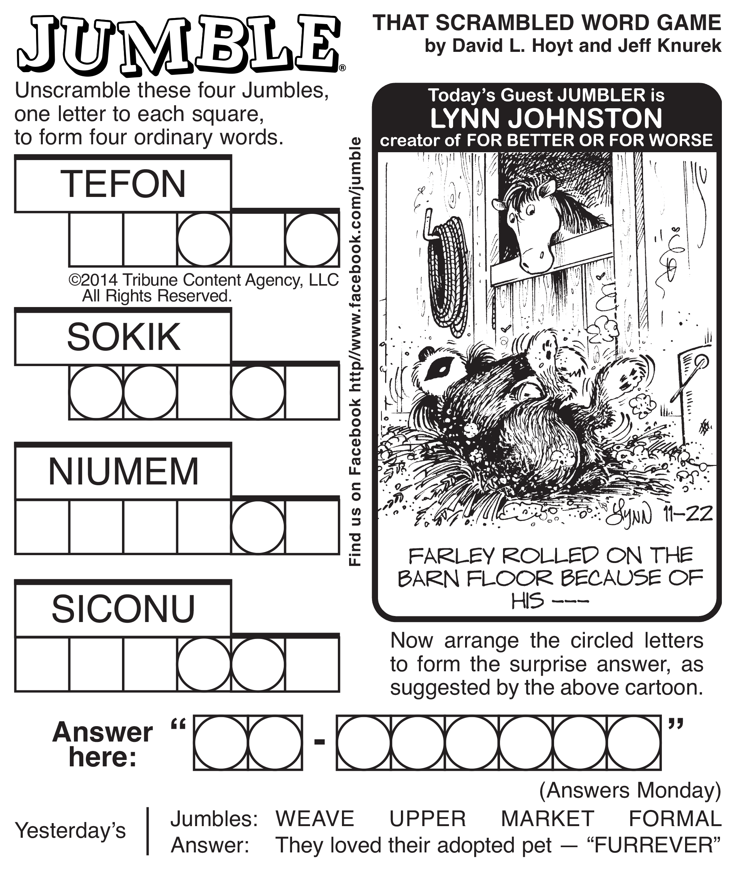

# ACS-2130: Word Jumble Solver 

## _From the [assignment](https://github.com/Tech-at-DU/ACS-2130-Core-Data-Structures/blob/master/Projects/WordJumble/README.md)_:

>The challenge is to design a way to solve this word jumble with a computer! Use what you've learned in the course to automate solving this puzzle!
>
>For the first 4 words, each jumble of letters is actually an anagram of a word in an English dictionary. Your first task is to rearrange them to discover the real word they represent.
>
>Once you solve all 4 words, look at where the circles are. All of the letters within the circles should be added to a letter bank, which you'll unscramble and use to solve the final jumble, which is a hyphenated phrase that's an answer to the the punny riddle in the picture.

### Pseudocode used to solve the challenge

